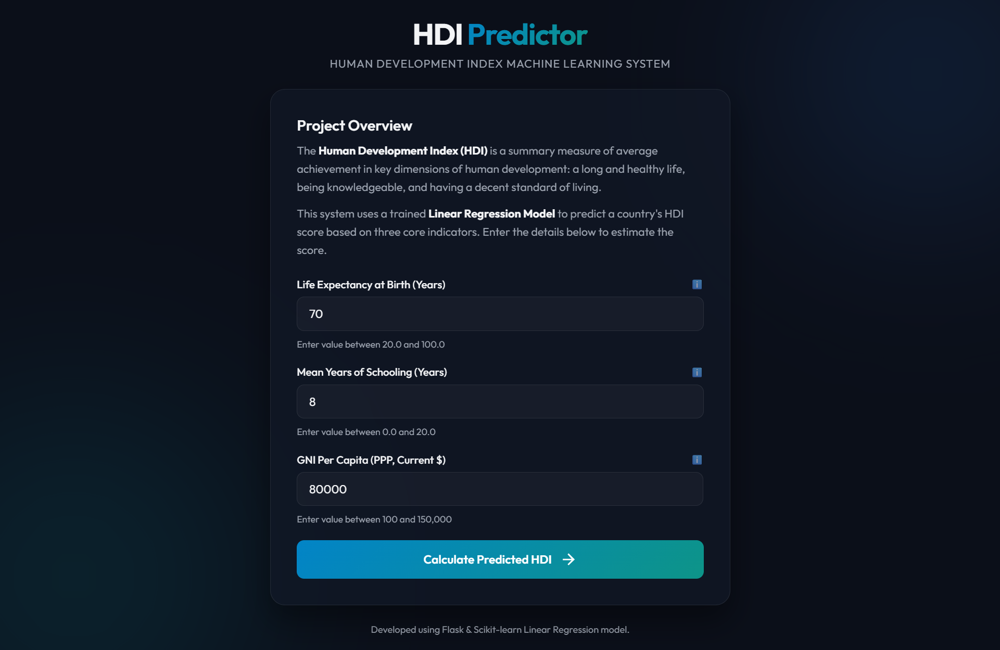
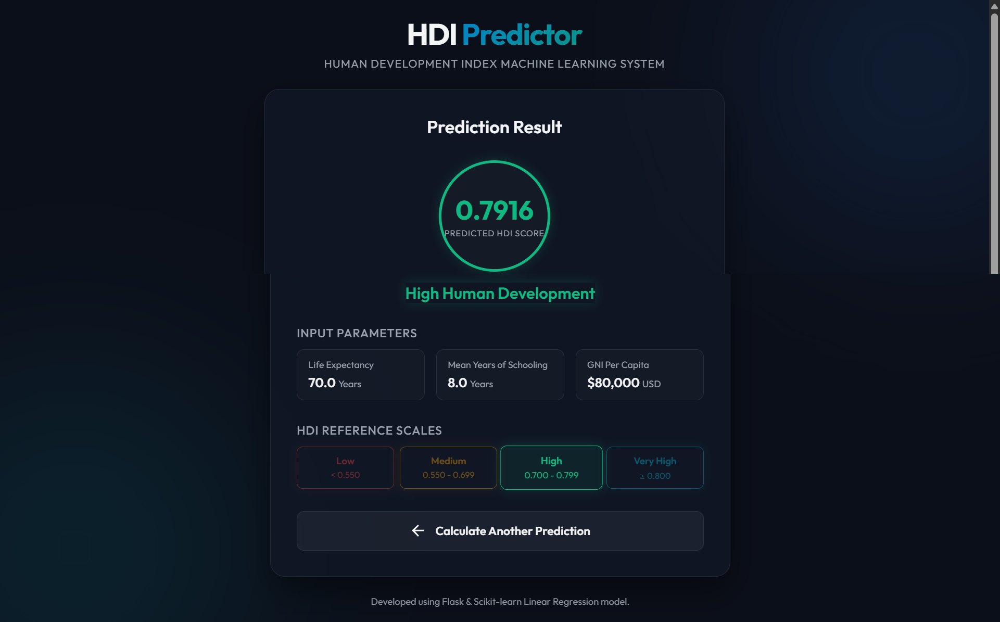

# A-comprehensive-measures-of-well-being
A comprehensive measure of well-being is a way of measuring the overall quality of life of people. It includes not only income but also health, education, living standards, safety, environment, and happiness. It helps understand how well people are living and supports governments in making better policies for development.
# A-Comprehensive-Measure-of-Well-Being
Comprehensive Measure of Well-Being is a way to evaluate a person's overall quality of life. It includes not only physical health but also mental, emotional, social, and financial well-being. It helps understand how satisfied and healthy people are in different aspects of life, leading to better personal and community development.

# Human Development Index (HDI) Prediction System

[](https://drive.google.com/file/d/1NTuKqvSZDWj6mxcPyroNCTFybO-rs0jp/view?usp=sharing)
[](https://hdi-predictor-7cwb.onrender.com/)
[](https://www.python.org/)
[](https://flask.palletsprojects.com/)

An end-to-end Machine Learning project to analyze, predict, and classify country development levels using the **Human Development Index (HDI)** scale. The application features a Scikit-learn Linear Regression model trained on real-world UNDP indicators, serialized with Pickle, and served through a responsive Flask web interface.

---

## 🏛️ Academic Documentation Hub

This repository has been structured to meet the strict standards required for virtual internship verification and academic project audits. Use the quick links below to navigate the detailed reports:

| Phase / Section | Focus Area | Description |
| :--- | :--- | :--- |
| 🚀 **[Project Overview](docs/Project_Overview.md)** | Problem Statement & Scope | Contextualizes the social science problem, engineering objectives, and boundary constraints. |
| ⚙️ **[System Architecture](docs/Architecture.md)** | Infrastructure & Data Flow | Visualizes the client-server pipeline, MVC structures, and data processing sequences (Mermaid Diagrams). |
| 📊 **[Methodology & Math](docs/Methodology.md)** | Training & Mathematical Equation | Explains dataset sourcing, EDA, model coefficients ($\beta$ values), and OLS training choices. |
| 📈 **[Performance & Results](docs/Results.md)** | Metrics & Predictions | Details model accuracy ($R^2=0.946$), residual standard deviation, and outputs validation scenarios. |
| 🎓 **[Viva Voce Prep](docs/Viva_Prep.md)** | Project Defense & FAQs | Comprehensive Q&A covering 15 core technical defense topics for virtual internship evaluation. |

---

## 🎓 Internship Milestones

To align with the SmartBridge / MySkillWallet AI-ML-GEN AI Project Template structure, this repository is organized into milestone-based directories:

* **[1. Brainstorming & Ideation](./1.%20Brainstorming%20%26%20Ideation/)** - Problem statement and context formulation.
* **[2. Requirement Analysis](./2.%20Requirement%20Analysis/)** - Functional and non-functional specifications.
* **[3. Project Design Phase](./3.%20Project%20Design%20Phase/)** - MVC architecture and backend validation design.
* **[4. Project Planning Phase](./4.%20Project%20Planning%20Phase/)** - Project timeline, resource choice, and methodology setup.
* **[5. Project Development Phase](./5.%20Project%20Development%20Phase/)** - Model parameters & controller development.
* **[6. Project Testing](./6.%20Project%20Testing/)** - Validation scenarios, edge case testing, and metrics evaluation.
* **[7. Project Documentation](./7.%20Project%20Documentation/)** - Core academic reports index.
* **[8. Project Demonstration](./8.%20Project%20Demonstration/)** - Live deployment & walkthrough links.

---

## 🚀 Key Features

* **Real-World Dataset:** Based on UNDP Human Development Report indicators covering 150 countries representing diverse developmental stages.
* **Linear Regression Model:** An interpretable regression model trained on raw values for Life Expectancy, Mean Years of Schooling, and GNI Per Capita, achieving a fit of **R² ≈ 0.946**.
* **Responsive Web Interface:** A custom Flask interface applying modern glassmorphic layouts and detailed output cards showing UNDP bracket classifications.
* **Validation & Safety Layers:** Dynamic boundary range validations for user forms to prevent out-of-distribution mathematical predictions.
* **Official UNDP Brackets:** Dynamic classification into standard developmental brackets:
  * **Low Human Development** ($HDI < 0.550$)
  * **Medium Human Development** ($0.550 \le HDI < 0.700$)
  * **High Human Development** ($0.700 \le HDI < 0.800$)
  * **Very High Human Development** ($HDI \ge 0.800$)

---

## 📈 Model Performance Dashboard

Our Ordinary Least Squares (OLS) model achieves the following validation performance:

```text
┌──────────────────────────────────────────────┐
│  R² Score (Coefficient of Determination)      │
│  ► 0.9459  (94.59% Variance Explained)       │
├──────────────────────────────────────────────┤
│  Mean Squared Error (MSE)                     │
│  ► 0.000738                                  │
├──────────────────────────────────────────────┤
│  Root Mean Squared Error (RMSE)              │
│  ► 0.0272  (Typical error < 0.03 HDI units)  │
└──────────────────────────────────────────────┘
```

---

## 📁 Repository Structure

```
hdi-prediction-system/
│
├── 1. Brainstorming & Ideation/
│   └── Problem_Statement.md  # Brainstorming notes & problem definition
├── 2. Requirement Analysis/
│   └── Requirement_Analysis.md # Functional & non-functional requirements
├── 3. Project Design Phase/
│   └── Solution_Architecture.md # System architecture & MVC setup
├── 4. Project Planning Phase/
│   └── Planning.md           # Implementation roadmap & resources
├── 5. Project Development Phase/
│   └── Development.md        # Model parameters & controller development
├── 6. Project Testing/
│   └── Testing.md            # Testing scenarios & OLS metrics
├── 7. Project Documentation/
│   └── Documentation.md      # Core academic documentation index
├── 8. Project Demonstration/
│   └── Demonstration.md      # Live deployment & walkthrough links
│
├── dataset/
│   └── hdi_data.csv          # Real-world representative UNDP dataset for 150 countries
│
├── notebooks/
│   └── hdi_analysis.ipynb    # Jupyter Notebook with full analysis, EDA, and model training
│
├── model/
│   └── hdi_model.pkl         # Pickled Linear Regression model binary
│
├── app/
│   ├── app.py                # Flask application logic
│   │
│   ├── templates/
│   │   ├── home.html         # Prediction input form
│   │   └─ result.html       # Prediction score display and bracket classification
│   │
│   └── static/
│       └── style.css         # Glassmorphism and responsive styling sheet
│
├── docs/                     # Academic Documentation Files
│   ├── Project_Overview.md   # Project Problem & Scope
│   ├── Architecture.md       # Diagrams & System Data Flow
│   ├── Methodology.md       # Mathematical modeling & justifications
│   ├── Results.md           # Metrics & verification examples
│   └── Viva_Prep.md          # 15+ Core Q&As for Project Defenses
│
├── demo/                     # Project Walkthrough Video
│   └── sr.mp4                # Screen recording walkthrough video
│
├── screenshots/              # UI Demonstration images
│   ├── HOME.png              # UI screenshot of home input page
│   └── RESULT.png            # UI screenshot of prediction output card
│
├── requirements.txt          # Python library dependencies
├── README.md                 # Dashboard Hub (This file)
└── .gitignore                # Git ignore configuration
```

---

## ⚙️ Setup and Installation

### 1. Prerequisites
Ensure you have **Python 3.8+** installed.

### 2. Clone the Repository
```bash
git clone <repository_url>
cd hdi-prediction-system
```

### 3. Create a Virtual Environment
```bash
# Windows
py -m venv .venv
.venv\Scripts\activate

# macOS/Linux
python3 -m venv .venv
source .venv/bin/activate
```

### 4. Install Dependencies
```bash
pip install -r requirements.txt
```

---

## 🖥️ How to Run

### Run the Analysis & Model Re-training
To execute exploratory data analysis and re-serialize the model binary:
1. Start Jupyter:
   ```bash
   jupyter notebook
   ```
2. Open and run all cells in `notebooks/hdi_analysis.ipynb`.

### Launch the Flask Web Application
1. Start the Flask server:
   ```bash
   # Windows
   py app/app.py

   # macOS/Linux
   python app/app.py
   ```
2. Navigate to: `http://127.0.0.1:5000`

## 🎥 Demo Video

This project includes both a local walkthrough video and a high-definition cloud demonstration:
* **🚀 Google Drive Demo Video:** [Recorded System Walkthrough](https://drive.google.com/file/d/1NTuKqvSZDWj6mxcPyroNCTFybO-rs0jp/view?usp=sharing)
  *(Provides a complete walkthrough of the application, including model training, server startup, and boundary validation, which can be used if the evaluator prefers a recorded demonstration)*
* **📂 Local Video File:** [sr.mp4](demo/sr.mp4) (Direct playback supported on GitHub)

---

## 📷 Application Showcases

### Home Form Page


### Prediction Result Page
# A-Comprehensive-Measure-of-Well-Being
Comprehensive Measure of Well-Being is a way to evaluate a person's overall quality of life. It includes not only physical health but also mental, emotional, social, and financial well-being. It helps understand how satisfied and healthy people are in different aspects of life, leading to better personal and community development.

# Human Development Index (HDI) Prediction System

[](https://drive.google.com/file/d/1NTuKqvSZDWj6mxcPyroNCTFybO-rs0jp/view?usp=sharing)
[](https://hdi-predictor-7cwb.onrender.com/)
[](https://www.python.org/)
[](https://flask.palletsprojects.com/)

An end-to-end Machine Learning project to analyze, predict, and classify country development levels using the **Human Development Index (HDI)** scale. The application features a Scikit-learn Linear Regression model trained on real-world UNDP indicators, serialized with Pickle, and served through a responsive Flask web interface.

---

## 🏛️ Academic Documentation Hub

This repository has been structured to meet the strict standards required for virtual internship verification and academic project audits. Use the quick links below to navigate the detailed reports:

| Phase / Section | Focus Area | Description |
| :--- | :--- | :--- |
| 🚀 **[Project Overview](docs/Project_Overview.md)** | Problem Statement & Scope | Contextualizes the social science problem, engineering objectives, and boundary constraints. |
| ⚙️ **[System Architecture](docs/Architecture.md)** | Infrastructure & Data Flow | Visualizes the client-server pipeline, MVC structures, and data processing sequences (Mermaid Diagrams). |
| 📊 **[Methodology & Math](docs/Methodology.md)** | Training & Mathematical Equation | Explains dataset sourcing, EDA, model coefficients ($\beta$ values), and OLS training choices. |
| 📈 **[Performance & Results](docs/Results.md)** | Metrics & Predictions | Details model accuracy ($R^2=0.946$), residual standard deviation, and outputs validation scenarios. |
| 🎓 **[Viva Voce Prep](docs/Viva_Prep.md)** | Project Defense & FAQs | Comprehensive Q&A covering 15 core technical defense topics for virtual internship evaluation. |

---

## 🎓 Internship Milestones

To align with the SmartBridge / MySkillWallet AI-ML-GEN AI Project Template structure, this repository is organized into milestone-based directories:

* **[1. Brainstorming & Ideation](./1.%20Brainstorming%20%26%20Ideation/)** - Problem statement and context formulation.
* **[2. Requirement Analysis](./2.%20Requirement%20Analysis/)** - Functional and non-functional specifications.
* **[3. Project Design Phase](./3.%20Project%20Design%20Phase/)** - MVC architecture and backend validation design.
* **[4. Project Planning Phase](./4.%20Project%20Planning%20Phase/)** - Project timeline, resource choice, and methodology setup.
* **[5. Project Development Phase](./5.%20Project%20Development%20Phase/)** - Model parameters & controller development.
* **[6. Project Testing](./6.%20Project%20Testing/)** - Validation scenarios, edge case testing, and metrics evaluation.
* **[7. Project Documentation](./7.%20Project%20Documentation/)** - Core academic reports index.
* **[8. Project Demonstration](./8.%20Project%20Demonstration/)** - Live deployment & walkthrough links.

---

## 🚀 Key Features

* **Real-World Dataset:** Based on UNDP Human Development Report indicators covering 150 countries representing diverse developmental stages.
* **Linear Regression Model:** An interpretable regression model trained on raw values for Life Expectancy, Mean Years of Schooling, and GNI Per Capita, achieving a fit of **R² ≈ 0.946**.
* **Responsive Web Interface:** A custom Flask interface applying modern glassmorphic layouts and detailed output cards showing UNDP bracket classifications.
* **Validation & Safety Layers:** Dynamic boundary range validations for user forms to prevent out-of-distribution mathematical predictions.
* **Official UNDP Brackets:** Dynamic classification into standard developmental brackets:
  * **Low Human Development** ($HDI < 0.550$)
  * **Medium Human Development** ($0.550 \le HDI < 0.700$)
  * **High Human Development** ($0.700 \le HDI < 0.800$)
  * **Very High Human Development** ($HDI \ge 0.800$)

---

## 📈 Model Performance Dashboard

Our Ordinary Least Squares (OLS) model achieves the following validation performance:

```text
┌──────────────────────────────────────────────┐
│  R² Score (Coefficient of Determination)      │
│  ► 0.9459  (94.59% Variance Explained)       │
├──────────────────────────────────────────────┤
│  Mean Squared Error (MSE)                     │
│  ► 0.000738                                  │
├──────────────────────────────────────────────┤
│  Root Mean Squared Error (RMSE)              │
│  ► 0.0272  (Typical error < 0.03 HDI units)  │
└──────────────────────────────────────────────┘
```

---

## 📁 Repository Structure

```
hdi-prediction-system/
│
├── 1. Brainstorming & Ideation/
│   └── Problem_Statement.md  # Brainstorming notes & problem definition
├── 2. Requirement Analysis/
│   └── Requirement_Analysis.md # Functional & non-functional requirements
├── 3. Project Design Phase/
│   └── Solution_Architecture.md # System architecture & MVC setup
├── 4. Project Planning Phase/
│   └── Planning.md           # Implementation roadmap & resources
├── 5. Project Development Phase/
│   └── Development.md        # Model parameters & controller development
├── 6. Project Testing/
│   └── Testing.md            # Testing scenarios & OLS metrics
├── 7. Project Documentation/
│   └── Documentation.md      # Core academic documentation index
├── 8. Project Demonstration/
│   └── Demonstration.md      # Live deployment & walkthrough links
│
├── dataset/
│   └── hdi_data.csv          # Real-world representative UNDP dataset for 150 countries
│
├── notebooks/
│   └── hdi_analysis.ipynb    # Jupyter Notebook with full analysis, EDA, and model training
│
├── model/
│   └── hdi_model.pkl         # Pickled Linear Regression model binary
│
├── app/
│   ├── app.py                # Flask application logic
│   │
│   ├── templates/
│   │   ├── home.html         # Prediction input form
│   │   └─ result.html       # Prediction score display and bracket classification
│   │
│   └── static/
│       └── style.css         # Glassmorphism and responsive styling sheet
│
├── docs/                     # Academic Documentation Files
│   ├── Project_Overview.md   # Project Problem & Scope
│   ├── Architecture.md       # Diagrams & System Data Flow
│   ├── Methodology.md       # Mathematical modeling & justifications
│   ├── Results.md           # Metrics & verification examples
│   └── Viva_Prep.md          # 15+ Core Q&As for Project Defenses
│
├── demo/                     # Project Walkthrough Video
│   └── sr.mp4                # Screen recording walkthrough video
│
├── screenshots/              # UI Demonstration images
│   ├── HOME.png              # UI screenshot of home input page
│   └── RESULT.png            # UI screenshot of prediction output card
│
├── requirements.txt          # Python library dependencies
├── README.md                 # Dashboard Hub (This file)
└── .gitignore                # Git ignore configuration
```

---

## ⚙️ Setup and Installation

### 1. Prerequisites
Ensure you have **Python 3.8+** installed.

### 2. Clone the Repository
```bash
git clone <repository_url>
cd hdi-prediction-system
```

### 3. Create a Virtual Environment
```bash
# Windows
py -m venv .venv
.venv\Scripts\activate

# macOS/Linux
python3 -m venv .venv
source .venv/bin/activate
```

### 4. Install Dependencies
```bash
pip install -r requirements.txt
```

---

## 🖥️ How to Run

### Run the Analysis & Model Re-training
To execute exploratory data analysis and re-serialize the model binary:
1. Start Jupyter:
   ```bash
   jupyter notebook
   ```
2. Open and run all cells in `notebooks/hdi_analysis.ipynb`.

### Launch the Flask Web Application
1. Start the Flask server:
   ```bash
   # Windows
   py app/app.py

   # macOS/Linux
   python app/app.py
   ```
2. Navigate to: `http://127.0.0.1:5000`

## 🎥 Demo Video

This project includes both a local walkthrough video and a high-definition cloud demonstration:
* **🚀 Google Drive Demo Video:** [Recorded System Walkthrough](https://drive.google.com/file/d/1NTuKqvSZDWj6mxcPyroNCTFybO-rs0jp/view?usp=sharing)
  *(Provides a complete walkthrough of the application, including model training, server startup, and boundary validation, which can be used if the evaluator prefers a recorded demonstration)*
* **📂 Local Video File:** [sr.mp4](demo/sr.mp4) (Direct playback supported on GitHub)

---

## 📷 Application Showcases

### Home Form Page


### Prediction Result Page

