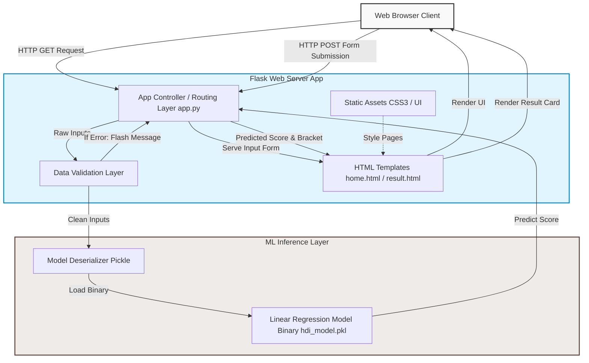

# System Architecture & Workflow

This document details the system design, data flow pipelines, and component breakdown of the **HDI Prediction System**.

---

## 1. System Architecture

The application is structured following a classic **Model-View-Controller (MVC)** architectural pattern adapted for lightweight ML microservices:



### Component Roles

1. **Client (View / Front-End):** Built with HTML5 and custom Glassmorphism CSS3 styles. It gathers user parameters and displays results.
2. **Flask Application (Controller):** Located in `app/app.py`. It manages routing (`/` and `/predict`), handles HTTP requests, handles session flashing for validation errors, and performs classification grouping.
3. **Validation Layer:** Enforces strict domain limits on input values (e.g. Life Expectancy $\in [20, 100]$) to protect model integrity.
4. **Machine Learning Model (Model / Inference Engine):** A Scikit-learn Linear Regression model pickled to `model/hdi_model.pkl`. It performs prediction vector computations on clean numerical features.

---

## 2. End-to-End Data Flow

The end-to-end data transmission and transformations proceed through six sequential phases:

```
[ User Inputs ]
   │
   ├─► Life Expectancy (Years)
   ├─► Mean Years of Schooling (Years)
   └─► GNI Per Capita (USD PPP)
   │
   ▼
[ HTTP POST Request ] ──► Form payload transmitted to Flask backend
   │
   ▼
[ Input Validation ] ──► boundary checks (Life Exp: 20-100; Schooling: 0-20; GNI: 100-150k)
   │
   ├─► [FAIL] ──► Session Flash Error ──► Redirect to Home Page
   │
   └─► [PASS] ──► Cast raw strings to Float variables
   │
   ▼
[ Pickled Model Load ] ──► app.py loads model binary from 'model/hdi_model.pkl' (Global Startup)
   │
   ▼
[ ML Model Inference ] ──► Scikit-learn LR predicts: score = model.predict([[L, S, G]])
   │
   ▼
[ Logic Post-Processing ]
   │
   ├─► Clip score to absolute bounds [0.0, 1.0]
   ├─► Map score to UNDP Development Group (Low / Medium / High / Very High)
   │
   ▼
[ Render Results Page ] ──► Return result.html with styled bracket classifications
```

---

## 3. Technology Stack Rationale

| Layer | Component | Selection | Justification |
| :--- | :--- | :--- | :--- |
| **Logic / ML** | Python | `python 3.8+` | Universal standard for data science and ML pipelines. |
| **Data Manipulation** | Pandas & NumPy | `pandas`, `numpy` | Efficient array vectorization and structure loading. |
| **Web Server** | Flask | `flask` | Lightweight WSGI micro-framework, perfect for microservices. |
| **Serialization** | Pickle | `pickle` | Native Python serialization with zero overhead for saving regression model weights. |
| **Inference Engine** | Scikit-learn | `scikit-learn` | Robust and industry-standard machine learning engine. |
